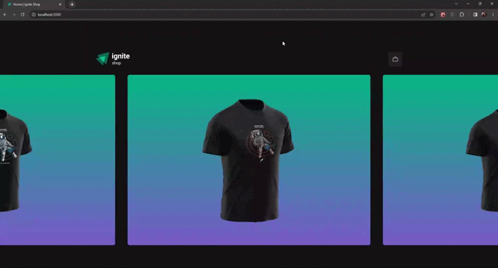

  
  
  <h2> <strong>Ignite Shop</strong> </h2>

  <h3>Um e-commerce com as melhores camisetas</h3>

   [Introdução](#-introdução) |
   [Utilização](#-utilizacao) |
   [Tecnologias Utilizadas](#-tecnologias-utilizadas) 

---

# 👨🏻‍💻 Introdução

## Objetivo

O objetivo principal dessa aplicação foi aprender as funcionalidades do [Next.js](https://nextjs.org/) e suas ferramentas para renderização da aplicação do lado do servidor e também a integração com a API do [Stripe](https://stripe.com/) para buscar os produtos cadastrados e fazer checkout da compra.

A criação dessa aplicação foi com o intuito de praticar e aprender mais sobre o desenvolvimento em [ReactJS](https://react.dev/) e suas tecnologias.

## Esse repositório possui

- Todo os arquivos de desenvolvimento da aplicação;
- Estruturação em componentes;
- Icons e SVGs utilizados na aplicação.

## Projeto

Utilizado o Next.js para geração da aplicação e para estilização foi utilizada a biblioteca Stitches.

Esse projeto foi desenvolvido durante o curso Ignite da [Rocketseat](https://rocketseat.com.br/).

 

# 🛒 Utilização

  
  

    
  

   

Acesse o e-commerce escolha as camisetas que combina com você. Podendo colocar elas direto no carrinho ou ver mais detalhes antes de escolher.

Com o carrinho pronto basta finalizar a compra e fazer o checkout no stripe.

 

# 🚀 Tecnologias/Bibliotecas utilizadas

- [Next.js](https://nextjs.org/)
- [Immer](https://immerjs.github.io/immer/)
- [Axios](https://axios-http.com/)
- [Stitches](https://stitches.dev/)
- [Keen-Slider](https://keen-slider.io/)
- [UUID](https://www.uuidgenerator.net/)

---

Made by

- [**Gabriel Carvalho**](https://github.com/GabrielCarvf) 🤘🏻|  [LinkedIn](https://www.linkedin.com/in/gabriel-carvalho-5ba636182/)
